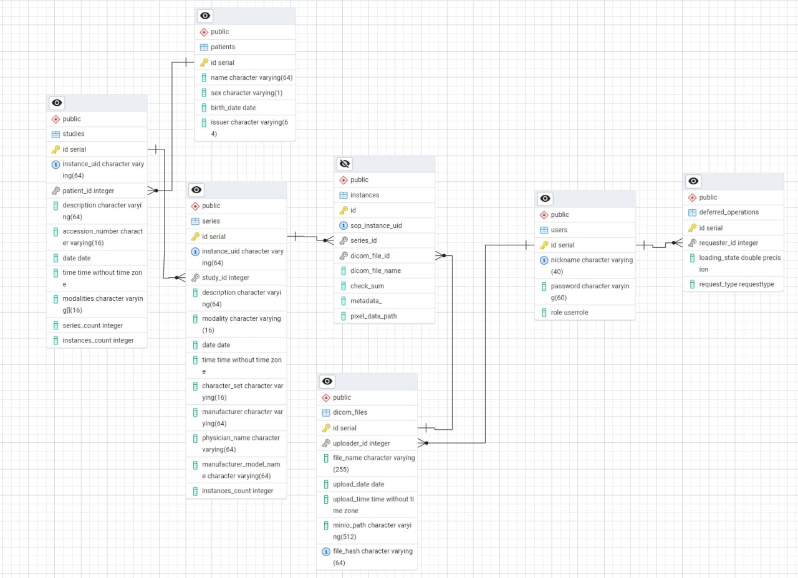
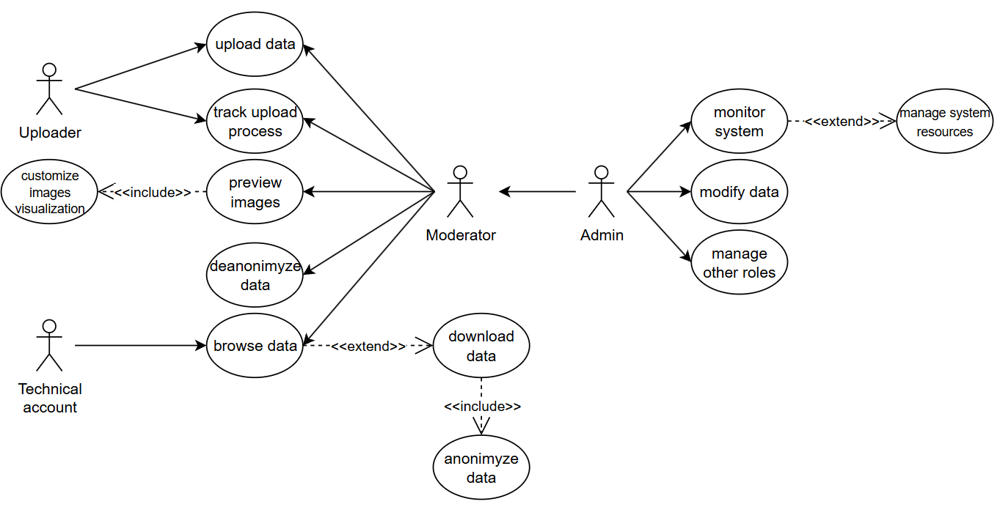

# Описание
Система хранения, индексирования и визуализации медицинских данных в формате DICOM.
Проект направлен на проектирование и разработку системы хранения в виде web-сервиса и API, индексирования и визуализации медицинских данных в формате DICOM.
# Данные

# Пользовательские роли

- Загрузчик: загрузка архивов
- Технический аккаунт: просмотр загруженных данных и их скачивание
- Модератор: всё вышеперечисленное
- Администратор: всё вышеперечисленное + изменение данных
# UI / API
Пользовательский интерфейс в браузере с различным отображением для разных ролей. Наличие браузера загруженных архивов. Визуализация DICOM.
# Технологии разработки
* Frontend:
    - React
    - NextJS 
    - CornerstoneJS (визуализатор)
* Backend:
  - Фреймворк - FastAPI
  - Система управления базой данных - PostgreSQL
  - Объектное хранилище - MinIO
  - Брокер сообщений - RabbitMQ
# Тестирование
Тестирование на предоставленном заказчиком архиве с более чем 3 тысячами снимков.